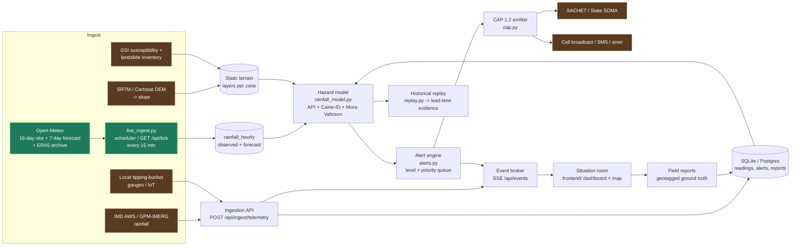

# Architecture — Code Nexus

## Pipeline

Green = wired in the prototype. Dashed brown = contracted but stubbed
(`backend/data_connectors.py` lists connection status per source).

## Components

| Module | Responsibility |
| --- | --- |
| `backend/app.py` | Flask API + serves the dashboard |
| `backend/rainfall_model.py` | Antecedent index, Caine ID threshold, hazard composition |
| `backend/risk_engine.py` | Older flat weighted baseline (kept for comparison) |
| `backend/replay.py` | Fetch real past rainfall (ERA5) → risk trajectory → lead time |
| `backend/alerts.py` | Level mapping, recommended action, risk×exposure priority queue |
| `backend/cap.py` | CAP 1.2 (SACHET-compatible) alert output |
| `backend/simulator.py` | Scenario boosts + SQLite persistence |
| `backend/realtime.py` | In-process pub/sub for Server-Sent Events |
| `backend/open_meteo.py` | Live weather adapter |
| `frontend/` | Situation room: map, zone intelligence, alerts, field reports, replay |

## Data / control flow at runtime

1. A rainfall reading arrives (`POST /api/ingest/telemetry`) or the Open-Meteo
   sync runs.
2. It is validated, persisted, and published to connected dashboards over SSE.
3. On request (`/api/risk`, `/api/alerts`) the hazard model combines the reading's
   antecedent + intensity signal with the zone's static terrain layers.
4. The alert engine assigns a level and orders zones by risk × exposure.
5. High/Critical zones produce a CAP message for downstream dissemination.
6. Field reports feed geotagged ground truth back into the store.

## Scaling & deployment

- **Stateless API** behind a WSGI server (gunicorn); horizontal scale for read
  load. Move persistence to managed Postgres; move SSE to Redis pub/sub or a
  managed broker.
- **Offline-first dashboard** — Northeastern connectivity is intermittent; the
  frontend already runs from cached state and a polling fallback. Target: a PWA
  that a district officer can open with no signal and sync when back online.
- **Cost envelope (order-of-magnitude, one district):** Open-Meteo + ERA5 are
  free; GPM-IMERG is free; a small always-on API instance + managed DB is a few
  US$/month. The dominant real cost is field gauges and their telemetry, not
  compute.
- **Rollout:** one validated pilot corridor → district → state, adding real DEM
  and GSI layers per area as calibration data accrues.
